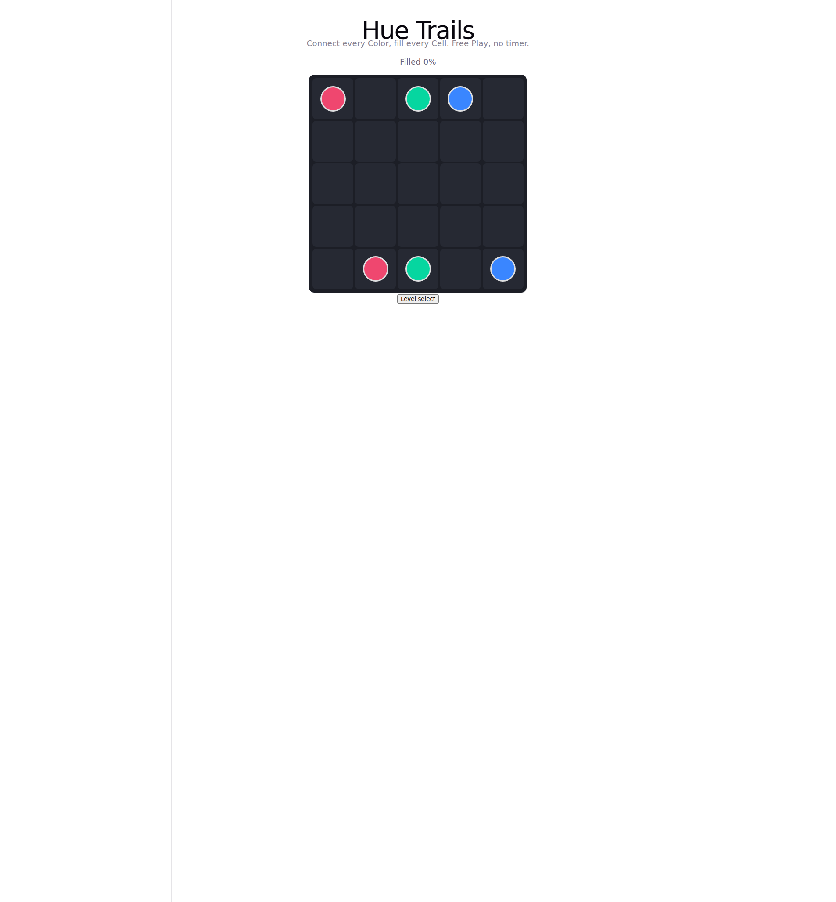

# Pipe Trails — Free Play pipe puzzle

A relaxed, free, Flow Free-style puzzle game for the web. Connect each
Color's two Endpoints with a Pipe and fill every Cell of the Board — no
install, no timer, no account. Open the page and play at your own pace.

This exists to validate the core Pipe mechanic fast: a web app with zero
install and zero deploy friction (see
`docs/adr/0001-web-first-instead-of-native-ios.md`), built with Vite +
TypeScript + React for type safety and testability as the Pack grows (see
`docs/adr/0002-vite-typescript-react-for-web-v1.md`).



## How to play

1. Pick a Level on the level-select screen. Levels unlock in order and are
   grouped by Board size (5x5 up to 8x8).
2. Drag from an Endpoint across orthogonally adjacent Cells to draw a Pipe.
   Works with mouse and touch.
3. Reroute freely: drawing through a rival Pipe cuts it back to the cut
   Cell; dragging back along your own Pipe erases its tail; tapping an
   Endpoint clears that whole Color.
4. A Level is solved only when every Cell is filled **and** every Color is
   connected. The fill-% HUD shows how close the Board is; the win overlay
   offers the next Level.
5. Progress, sound, and animation settings persist per browser
   (`localStorage`). Use *Reset progress* on the level-select screen to
   start over. After the first load the game keeps working offline.

## Prerequisites

- [Node.js](https://nodejs.org/) 22 (tested with v22.22.1, npm 11.18.0).
  Vite 8 requires a recent Node 20.19+ or 22.x.

## Installation

Clone the repository and install dependencies:

```bash
git clone https://github.com/gerrcass/flow-free-clone.git
cd flow-free-clone
npm install
```

## Usage

Start the dev server and open the printed URL (usually
`http://localhost:5173/`):

```bash
npm run dev
```

Run the test suite (Vitest, 10 files / 55 tests):

```bash
npm test
```

Lint and typecheck:

```bash
npm run lint   # oxlint
npx tsc -b     # typecheck (also runs as part of the build)
```

Build for production and preview the result. The build emits the offline
worker and manifest into `dist/`:

```bash
npm run build    # tsc -b + vite build
npm run preview  # serve dist/ locally
```

Work with the Level Pack — the generator proposes Levels, the solver
proves each one completable before it ships:

```bash
npm run generate-pack  # propose Levels via src/game/generator.ts
npm run check-pack     # verify every Level via src/game/solver.ts
```

## Project structure

```text
src/
  App.tsx            # level-select vs in-Level view state, HUD, win overlay
  components/        # Board, LevelSelect — thin, render from game state
  game/              # pure game-state seam: reducer, win-check, pack,
                     # generator, solver, progress/storage, sound, theme,
                     # offline registration (each with vitest coverage)
public/
  sw.js              # offline worker: cache-first shell + navigate fallback
  manifest.webmanifest
scripts/             # generate-pack, check-pack entry points
docs/adr/            # architecture decisions (web-first, Vite + TS + React)
CONTEXT.md           # glossary: Board, Cell, Color, Endpoint, Pipe,
                     # Level, Pack, Free Play — use these terms, not the
                     # listed synonyms
```

Tests assert external behavior (state in, state out), not implementation
details. Vocabulary follows `CONTEXT.md`.

## Status

Web v1 (Free Play, 30-Level Pack, progression, branding, offline) is
complete. Deliberately out of scope for v1: Time Trial, daily puzzles,
hints, undo beyond drag-back erase, Boards above 8x8, larger Packs, move
counters, ratings, timers, leaderboards, accounts, backend sync, a native
wrapper, and component snapshot tests.

## License

There is no `LICENSE` file yet, so by default all rights are reserved and
reuse terms are undefined. If you want others to be able to use or modify
this code, add a license (e.g. MIT) first.

## Contact

Maintained by [@gerrcass](https://github.com/gerrcass). Questions, bugs,
and ideas are welcome as
[issues](https://github.com/gerrcass/flow-free-clone/issues).
